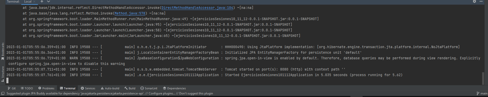

 # Ejercicios sesiones 10, 11 y 12

## Ejercicio 1
* Probar a empaquetar la aplicación con maven package desde Intellij IDEA


* Desde terminal en IntelliJ IDEA verificar que se ejecuta correctamente con el comando:
```
java -jar target/spring-deploy-1.0.jar
```



* Crear un perfil para dev y otro para test con una propiedad nueva que cargaremos en el controlador.

## Ejercicio 2
Desplegar el API REST de Latops en Heroku y verificar funcionamiento desde POSTMAN.

**Nota:** Heroku retiro sus planes gratuitos, en su lugar utilizar otra alternativa, en mi caso
[railway](https://railway.app/).

**Recomendación**: Es recomendable en la raíz del proyecto crear el fichero "system.properties" añadiendo la siguiente línea con el fin de forzar la versión de Java a usar y así evitar posibles problemas que puedan causar si sé cargarse la versión de Java por defecto del proveedor del servicio.
```
java.runtime.version=17
```
En mi caso es la versión 17 pero en tu caso debes de usar una versión que sea compatible con tu
proyecto.

Pasos para hacer un deployit en railway:

1. Crear repositorio en GitHub.
2. Crear cuenta / Iniciar sesión en railway.
3. Crear un nuevo proyecto en railway y asociar el repositorio al mismo.
4. Crear deploy.
5. Settings ➜ Generate domain, para tener un dominio de acceso.


Probando acceso desde postman:


## Ejercicio 3
Añadir Spring Security sobre el proyecto API REST de Laptops y configurar 2 usuarios en memoria
utilizando una clase WebSecurityConfig.

**Nota**: Varios métodos se han quedado deprecated para más información
del nuevo modo mirar la documentación oficial.
[https://spring.io/blog/2022/02/21/spring-security-without-the-websecurityconfigureradapter](https://spring.io/blog/2022/02/21/spring-security-without-the-websecurityconfigureradapter)

Además no olvidar añadir la siguiente dependencia al fichero "pomp.xml":

```xml
<dependency>
    <groupId>org.springframework.boot</groupId>
    <artifactId>spring-boot-starter-security</artifactId>
</dependency>

<dependency>
    <groupId>org.springframework.security</groupId>
    <artifactId>spring-security-test</artifactId>
    <scope>test</scope>
</dependency>
```